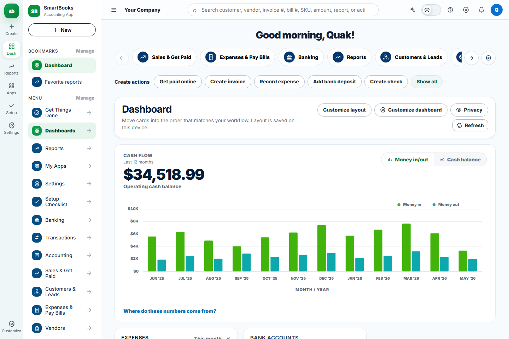
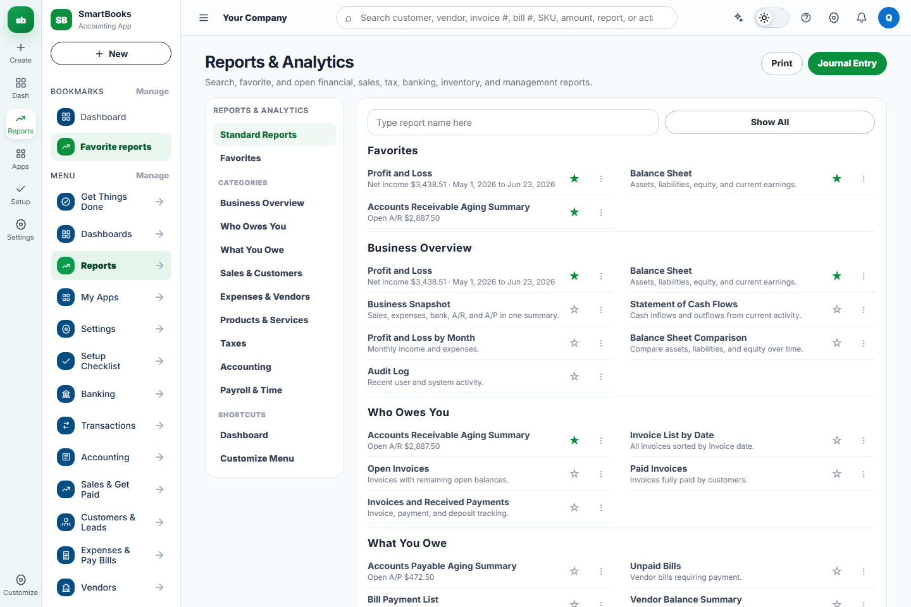
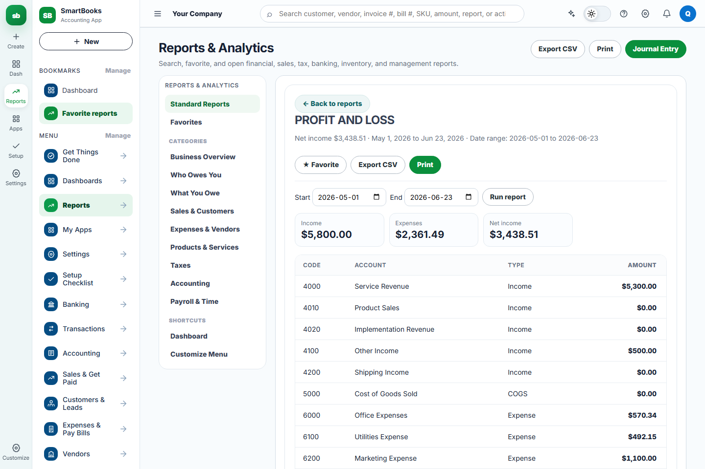
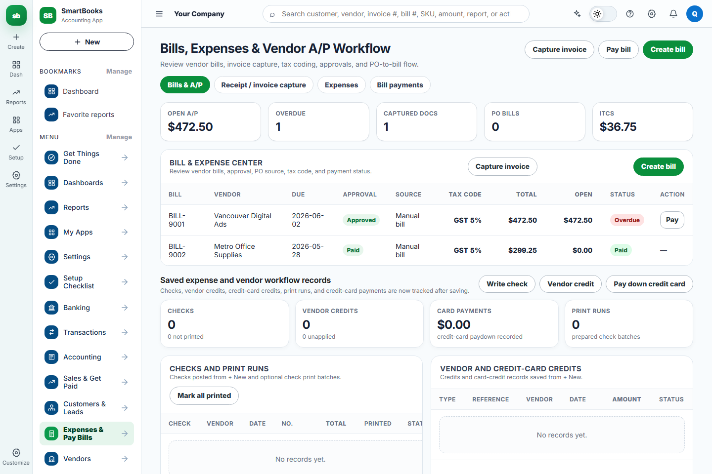
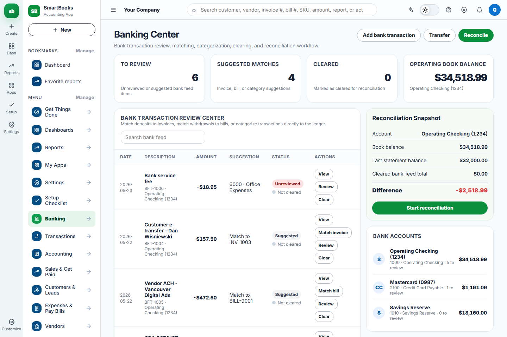
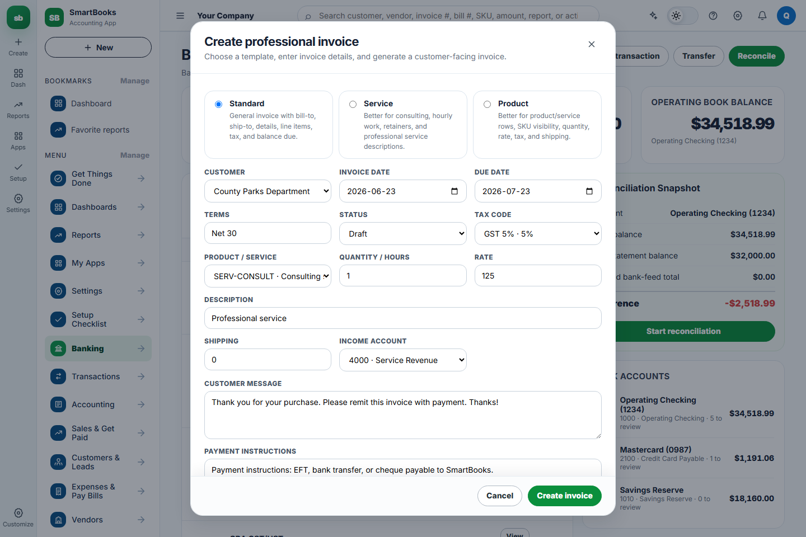
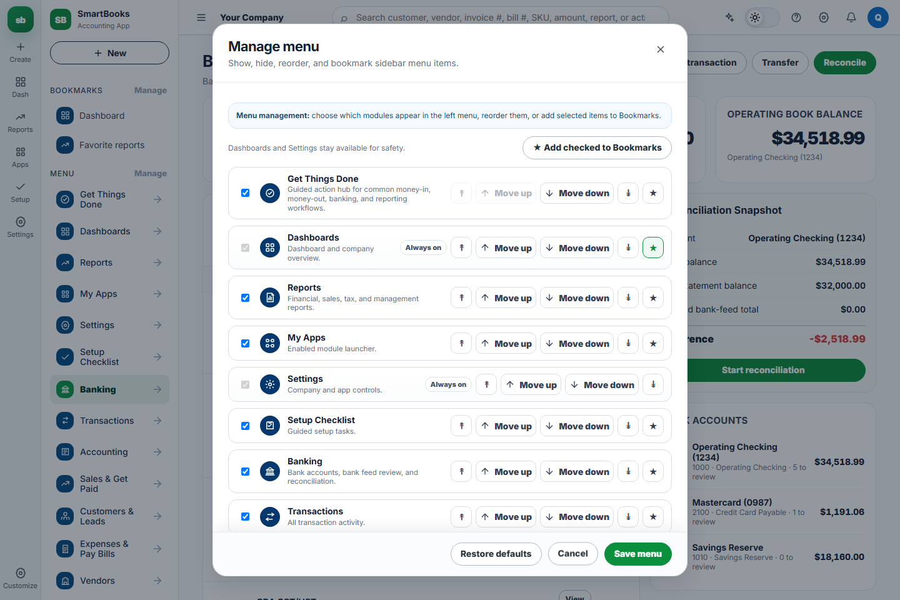
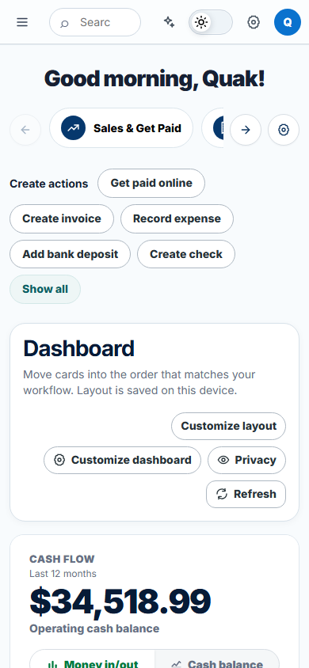

# SmartBooks UI/UX Audit Report

Date: 2026-06-23

## Summary

SmartBooks has made strong progress from a single-file prototype into a functional accounting app with real workflows, tests, documentation, and CI. The UI is now usable and much more stable than earlier icon/mojibake iterations, but it still reads as a fast-moving product prototype in several areas.

The next UI strategy should be **design stabilization before visual snapshot locking**. Formal visual snapshots should freeze a deliberate interface, not today's mixed patterns.

## What I Did

- Captured current UI evidence with Playwright from the local app.
- Reviewed the core shell, dashboard, reports, expenses workflow, banking center, invoice modal, customize menu modal, and mobile dashboard.
- Evaluated the app through an accounting-product lens: workflow clarity, trust in numbers, dense readability, navigation predictability, form consistency, and responsive behavior.
- Identified UI patterns that should become reusable conventions before formal `toHaveScreenshot()` snapshot baselines are introduced.

## Why I Did It

Accounting software needs a different design posture than a marketing site or decorative SaaS dashboard. The UI must feel calm, accurate, repeatable, and trustworthy. Users need to scan numbers, compare records, complete repeated workflows, and understand posting impact without guessing.

The goal of this audit is to define the design problems worth fixing before visual snapshot assertions make the current UI harder to change.

## Evidence Screenshots

| Area | Screenshot |
| --- | --- |
| Dashboard desktop |  |
| Reports center |  |
| Profit and Loss report |  |
| Expenses workflow |  |
| Banking center |  |
| Invoice modal |  |
| Customize menu modal |  |
| Mobile dashboard |  |

## Current Strengths

| Strength | Why it matters |
| --- | --- |
| Sidebar information architecture is much better than before | Dashboards, Reports, Apps, Settings, and Setup are easier to find. |
| Icon rendering is materially improved | The app no longer feels broken by mojibake in the main flows reviewed. |
| Accounting workflows expose real status and totals | Users can see open A/R, open A/P, paid bills, ITC, and bank impact. |
| Reports are moving toward operational clarity | Summary cards plus ledger-backed tables are a good direction. |
| Modals have meaningful accounting subtitles | Invoice, expense, bill, and payment modals explain posting impact. |
| Functional tests now protect several business workflows | UI changes can be checked against workflow correctness. |

## Design Strategy

SmartBooks should use a **quiet accounting console** strategy:

- Prefer dense but readable screens over decorative layouts.
- Make page structure predictable across modules.
- Treat numbers as first-class UI elements.
- Use status chips consistently.
- Make primary actions obvious and secondary actions available but calm.
- Use icons as navigation aids, not visual decoration.
- Keep modals consistent enough that users learn one form rhythm.
- Optimize desktop workflows first, but prevent mobile breakage.

## Priority Findings

### P1: Page Structure Is Not Yet Standardized

Pages use different arrangements for headers, action buttons, tabs, metrics, tables, and secondary records. Dashboard, Reports, Expenses, and Banking each have useful pieces, but the order and visual rhythm differ.

Why it matters:

- Users should not relearn layout logic on every page.
- Snapshot tests will become noisy if each screen has a different structural system.

Recommended improvement:

Use one page pattern:

```text
Page title + short description
Primary actions
Metric strip
Tabs or filters
Main table/report/workflow area
Secondary records or audit detail
```

### P1: Dashboard Needs A Clearer Operations Console Model

The dashboard has useful business information, but the current first viewport mixes greeting, carousel actions, create buttons, dashboard controls, and a large cash-flow card. It works, but it does not yet answer the most important accounting questions quickly enough.

Why it matters:

- The dashboard should tell users what needs attention today.
- The current visual weight leans heavily toward the cash-flow chart before showing tasks, risk, or exceptions.

Recommended improvement:

Reframe the dashboard around:

- Attention needed
- Money in
- Money out
- Cash position
- Open work
- Setup/accounting health

### P1: Mobile Layout Is Functional But Crowded

The mobile dashboard keeps the app usable, but the topbar is crowded, search is compressed, and create actions wrap heavily. Some desktop navigation controls become hidden, which is expected, but the mobile navigation pattern needs to be explicit.

Why it matters:

- Mobile does not need to support every dense accounting workflow, but it must not feel broken.
- Formal mobile snapshots should wait until navigation and action hierarchy are intentional.

Recommended improvement:

- Define a mobile shell pattern.
- Prefer a drawer or compact module switcher for navigation.
- Collapse secondary dashboard controls into a menu.
- Keep primary actions to one row or one vertical action group.

### P1: Tables Need One System

Reports, bills, payments, banking, and expense tables are improving, but table spacing, column priority, action placement, and row density still vary.

Why it matters:

- Accounting users compare rows and amounts repeatedly.
- Inconsistent row rhythm makes the app feel less reliable.

Recommended improvement:

Create a table convention:

- consistent header casing
- consistent row height
- right-aligned money columns
- fixed numeric spacing
- consistent status-chip placement
- actions in the final column
- empty states that match the table purpose

### P1: Modal Form Rhythm Should Become A Shared System

The invoice modal is much stronger now, but modal layout should be standardized across invoice, expense, bill, payment, customize menu, and company settings.

Why it matters:

- Repeated accounting workflows depend on learned form patterns.
- Snapshot baselines should verify one modal system, not many one-off layouts.

Recommended improvement:

Define modal standards:

- same header spacing
- icon-only close button
- consistent subtitle tone
- two-column grid on desktop
- single-column on mobile
- calculated total box
- sticky footer only when content overflows
- consistent cancel/save placement

### P2: Customize Menu Is Powerful But Dense

The customize menu supports visibility, ordering, and bookmarks, but it is visually dense. Users can perform the task, yet the action cluster competes with the item information.

Why it matters:

- This is an admin/configuration screen, so clarity matters more than speed.
- Dense rows make it easy to click the wrong reorder/bookmark control.

Recommended improvement:

- Group reorder controls together.
- Reduce repeated text labels where icon buttons are enough.
- Keep bookmark and visibility controls visually separate.
- Add a stronger selected/changed state before saving.

### P2: Reports Are Close, But Need Stronger Report Framing

The Profit and Loss and A/P Aging screens are readable, but report controls, summary cards, and tables should be visually standardized.

Why it matters:

- Reports are trust surfaces. Users judge accounting quality through them.

Recommended improvement:

- Use one report header pattern.
- Align date range controls and Run report consistently.
- Keep summary cards compact.
- Make export/print/favorite actions consistent across reports.

### P2: Color And Status Semantics Need A Formal Map

The interface uses green, blue, red, and neutral states, but the exact meaning of each color should be documented and enforced.

Why it matters:

- Green should not mean both "primary action" and "good status" without careful context.
- Red should remain reserved for overdue/error/destructive states.

Recommended improvement:

Create a status-color matrix:

| Semantic | Suggested use |
| --- | --- |
| Green | Success, paid, primary confirmation |
| Blue | Navigation, neutral module identity |
| Amber | Attention, pending, review needed |
| Red | Error, overdue, destructive |
| Gray | Secondary action, inactive, metadata |

## Recommended UI Improvement Sequence

| Order | Work | Expected result |
| --- | --- | --- |
| 1 | Define UI conventions in docs and CSS tokens | Shared spacing, type, color, border, icon, and table rules |
| 2 | Standardize page headers and action areas | Every major module starts with the same hierarchy |
| 3 | Standardize tables and report tables | Better scanability and fewer one-off table styles |
| 4 | Standardize modals | Invoice, expense, bill, payment, and customize screens feel related |
| 5 | Redesign dashboard as an operations console | First viewport answers attention, cash, money in/out, and open work |
| 6 | Clean mobile shell behavior | Mobile screenshots become stable enough for visual baselines |
| 7 | Add formal visual snapshot assertions | Baseline only the stabilized screens |

## Suggested Snapshot Readiness Criteria

Before adding formal Playwright `toHaveScreenshot()` assertions, the following should be true:

- Dashboard, Reports, Expenses, Banking, and major modals use shared layout conventions.
- Desktop and mobile first viewports have no clipped controls or awkward wrapping.
- Icons are centered and consistent across sidebars, topbar, buttons, and tabs.
- Tables use consistent money alignment and row spacing.
- Status chips use one semantic color system.
- Documentation screenshots and functional tests agree with the UI behavior.
- Temporary toasts are hidden or avoided in screenshot stories.

## Suggested First Visual Snapshot Set

Start small:

| Snapshot | Viewport |
| --- | --- |
| Dashboard shell | Desktop |
| Sidebar navigation | Desktop |
| Invoice modal | Desktop |
| Expense modal | Desktop |
| Bill modal | Desktop |
| Customize menu modal | Desktop |
| Profit and Loss report | Desktop |
| Accounts Payable Aging report | Desktop |
| Dashboard shell | Mobile |

Do not make the visual snapshot job required immediately. Run it locally first, then in CI as non-blocking or review-only until the UI baseline stops changing.

## Concrete Next Steps

1. Create or update a design-conventions document for UI tokens, page layout, table layout, modal layout, and status colors. **Completed in Pass 1.**
2. Implement a page-header and action-bar pattern across Dashboard, Reports, Expenses, Banking, and Sales. **Started in Pass 1 through the shared runtime UI baseline.**
3. Implement shared table classes for financial tables. **Started in Pass 1 through table scanability rules.**
4. Normalize modal layout and footer behavior. **Started in Pass 1 through modal rhythm rules.**
5. Rework Dashboard into an operations console.
6. Recheck desktop and mobile screenshots manually.
7. Add `npm run test:visual` with a small baseline set.

## Implementation Pass 1

Date: 2026-06-23

This pass implemented the first design-stabilization layer before formal snapshot assertions.

What changed:

- Added a runtime UI baseline that guarantees `body.v8-ui` is present.
- Standardized major page headers, dashboard headers, and action clusters.
- Standardized financial table rhythm, money alignment, and table overflow behavior.
- Normalized icon-only button dimensions so controls stay centered.
- Normalized modal header, body, footer, and mobile sizing behavior.
- Improved mobile wrapping for topbar, quick actions, page headers, and modal footers.
- Updated `docs/style-conventions.md` with the new UI stabilization baseline.

Why this matters:

- The app now has a clearer design target for future UI work.
- Existing screens can improve without rewriting every feature module at once.
- Formal screenshot assertions can be added later against a deliberate baseline instead of unstable one-off styling.

## Audit Conclusion

SmartBooks is ready for a focused UI stabilization phase. The app should not jump straight into formal visual snapshots yet. The next engineering step should be to standardize the UI system enough that snapshots protect a deliberate product experience instead of locking in inconsistent prototype patterns.
