# SmartBooks User Manual

This starter manual documents one high-value business flow in SmartBooks:

```text
Create invoice -> Receive payment -> Verify Accounts Receivable
```

The screenshots were captured from the current app UI with default demo data. Use this guide as both a user walkthrough and a business-logic reference when testing invoice and payment behavior.

## Flow 1: Create Invoice, Receive Payment, Verify A/R

### Business Logic Summary

| Step | User action | Expected accounting result |
| --- | --- | --- |
| Create invoice | Save a customer invoice for services | Debit Accounts Receivable, credit service revenue, credit GST/HST payable |
| Receive payment | Apply a payment to the invoice | Debit bank or undeposited funds, credit Accounts Receivable |
| Verify A/R | Open the A/R Aging Summary report | Paid invoice should no longer appear as an open receivable |

For the example below, the invoice uses:

| Field | Value |
| --- | --- |
| Customer | County Parks Department |
| Product / Service | Consulting |
| Quantity | 2 |
| Rate | 150 |
| Tax code | GST 5% |
| Subtotal | 300 |
| Tax | 15 |
| Invoice total | 315 |

### Step 1: Start From The Dashboard

Open SmartBooks and confirm the dashboard, sidebar, topbar, create controls, and widgets are visible.

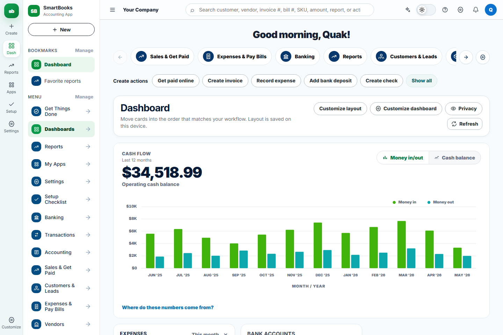

Expected result:

- The app loads without mojibake or broken icons.
- The left sidebar shows the default work menu. My Apps, Settings, and Setup Checklist are optional shortcuts that can be added from Manage.
- The create button and dashboard widgets are available.

### Step 2: Create The Invoice

Open the create invoice workflow, then enter the customer, invoice details, product/service, quantity, rate, tax code, and customer message.

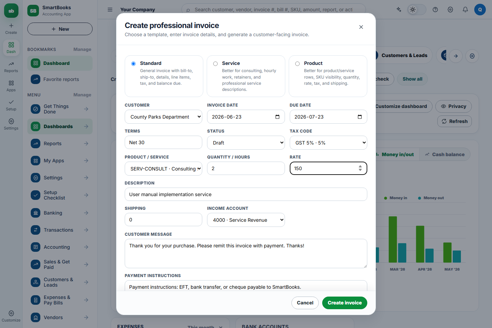

Use these example values:

| Field | Value |
| --- | --- |
| Template | Standard |
| Customer | County Parks Department |
| Invoice date | 2026-06-23 |
| Due date | 2026-07-23 |
| Terms | Net 30 |
| Product / Service | SERV-CONSULT - Consulting |
| Quantity / Hours | 2 |
| Rate | 150 |
| Description | User manual implementation service |
| Shipping | 0 |
| Income account | 4000 - Service Revenue |

Click **Create invoice**.

Expected result:

- SmartBooks creates a new invoice.
- Invoice subtotal is 300.
- GST/HST is 15.
- Invoice total is 315.
- Accounts Receivable increases by 315.
- Service revenue increases by 300.
- GST/HST payable increases by 15.

### Step 3: Confirm The Invoice Posted

Open the Sales & Get Paid area and confirm the new invoice appears as an open invoice.

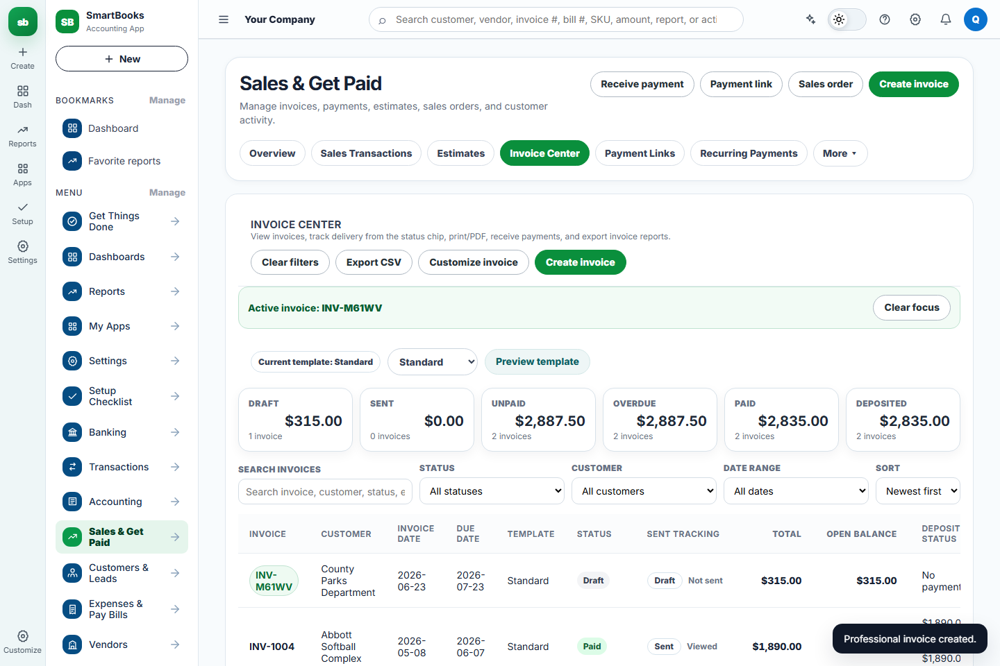

Expected result:

- The invoice appears in the sales workflow.
- The invoice is still unpaid or open.
- The open invoice balance matches the invoice total.

### Step 4: Receive Payment

Open the receive payment workflow and apply a 315 payment to the invoice.

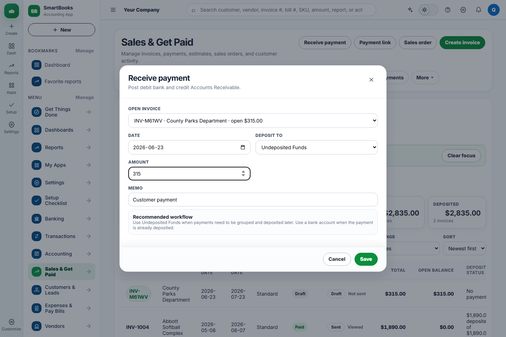

Use these example values:

| Field | Value |
| --- | --- |
| Customer | County Parks Department |
| Amount received | 315 |
| Payment method | Bank transfer, cash, cheque, or another configured method |
| Deposit account | Bank or undeposited funds |
| Invoice selected | The invoice created in Step 2 |

Click **Receive payment**.

Expected result:

- Payment is saved.
- Accounts Receivable decreases by 315.
- Bank or undeposited funds increases by 315.
- The invoice balance becomes 0.

### Step 5: Confirm The Invoice Is Paid

Return to Sales & Get Paid and confirm the invoice is no longer open.

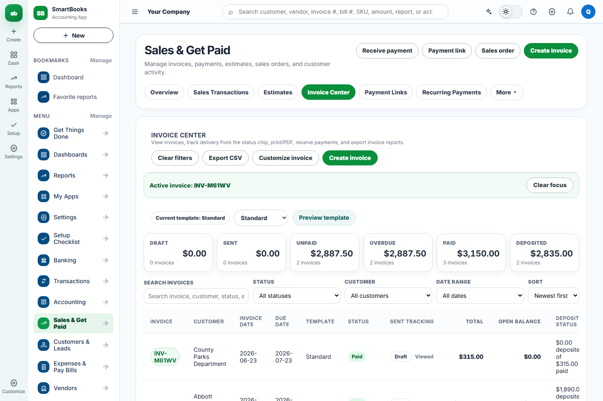

Expected result:

- The invoice status changes to paid.
- The invoice no longer contributes to open A/R.
- Payment activity is reflected in the customer and sales workflow.

### Step 6: Verify A/R Aging

Open Reports, then run **Accounts Receivable Aging Summary** for a date range that includes the invoice date.

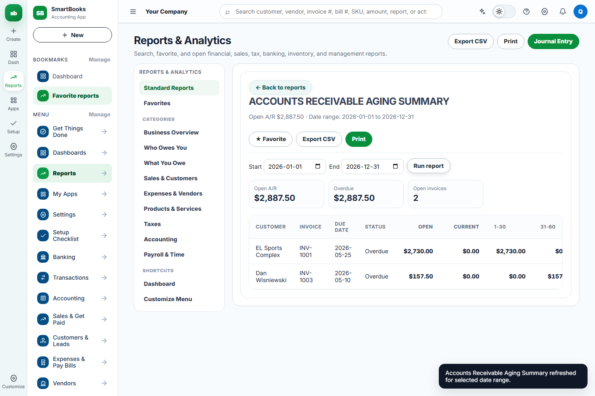

Use this date range for the example:

| Field | Value |
| --- | --- |
| Start | 2026-01-01 |
| End | 2026-12-31 |

Expected result:

- The report runs without errors.
- The paid invoice does not appear as an open receivable.
- Open A/R only includes unpaid invoices from the demo data.

## Flow 2: Record Expense, Verify Expense Report, Verify Bank/Cash Impact

### Business Logic Summary

| Step | User action | Expected accounting result |
| --- | --- | --- |
| Record expense | Save a paid vendor expense | Debit the selected expense account, debit recoverable GST/HST input tax credit, credit the paid-from bank or card account |
| Verify expense report | Open Profit and Loss | Expense total increases by the pre-tax expense amount, not the recoverable tax amount |
| Verify bank/cash | Open Banking Center | Bank or cash balance decreases by the full paid amount, including tax |

For the example below, the expense uses:

| Field | Value |
| --- | --- |
| Vendor | Metro Office Supplies |
| Expense account | 6000 - Office Expenses |
| Payment method | Bank transfer |
| Paid from | Operating Checking (1234) |
| Amount before tax | 240 |
| Purchase tax code | GST 5% |
| Calculated ITC / tax | 12 |
| Expense total paid | 252 |

Expected accounting effect:

| Account area | Expected change |
| --- | --- |
| Office Expenses | Increases by 240 |
| GST/HST input tax credit | Increases by 12 |
| Operating Checking | Decreases by 252 |
| Profit and Loss expenses | Increases by 240 |

### Step 1: Record The Expense

Open the record expense workflow and enter the vendor, expense account, payment method, paid-from account, amount, tax code, and memo.

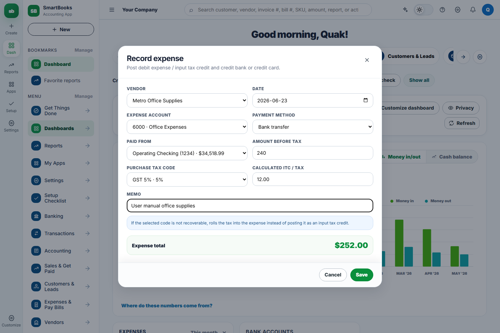

Use these example values:

| Field | Value |
| --- | --- |
| Vendor | Metro Office Supplies |
| Date | 2026-06-23 |
| Expense account | 6000 - Office Expenses |
| Payment method | Bank transfer |
| Paid from | Operating Checking (1234) |
| Amount before tax | 240 |
| Purchase tax code | GST 5% |
| Memo | User manual office supplies |

Click **Save**.

Expected result:

- SmartBooks records a paid expense.
- Calculated ITC / tax is 12.
- Expense total is 252.
- The selected expense category receives the pre-tax amount.
- The selected bank account is reduced by the full paid amount.

### Step 2: Confirm The Expense Posted

Open **Expenses & Pay Bills**, then select the **Expenses** tab.

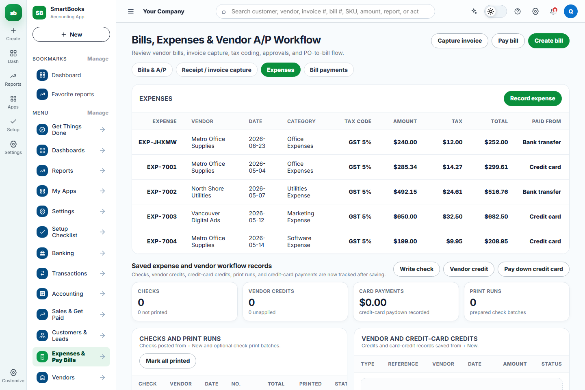

Expected result:

- The new expense appears at the top of the Expenses table.
- Amount shows 240.
- Tax shows 12.
- Total shows 252.
- Paid from shows Bank transfer.

### Step 3: Verify Profit And Loss

Open Reports, then open **Profit and Loss**.

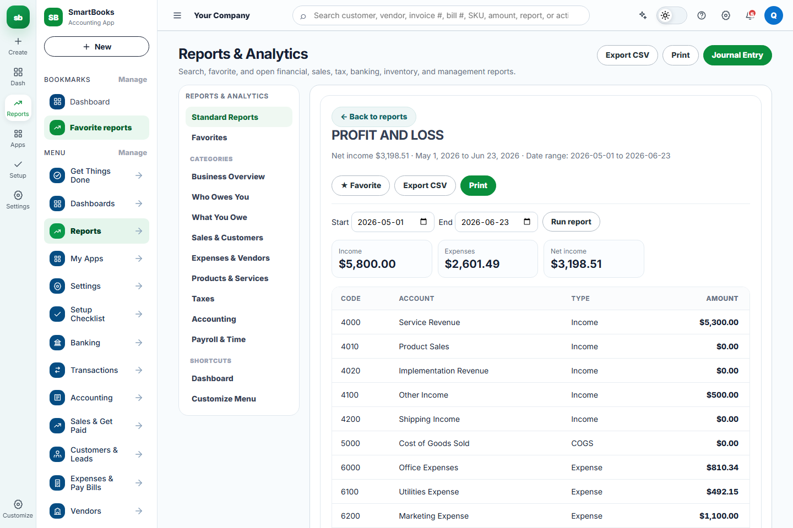

Expected result:

- Profit and Loss opens without errors.
- Expenses include the new pre-tax expense amount.
- In this example, total expenses increase from 2,361.49 to 2,601.49.
- Net income decreases by the pre-tax expense amount.
- The 12 recoverable tax amount is not treated as a P&L expense.

### Step 4: Verify Bank/Cash Impact

Open the Banking Center and review the Operating Book Balance and Bank Accounts section.

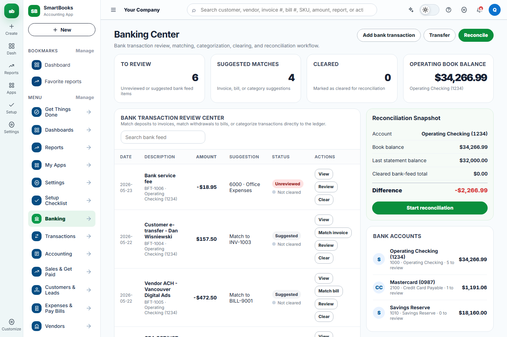

Expected result:

- Operating Checking decreases by the full paid amount.
- In this example, Operating Checking changes from 34,518.99 to 34,266.99.
- Total bank/cash impact is -252.
- The bank/cash movement includes both the expense amount and the recoverable tax amount because that is the actual cash paid.

## Flow 3: Create Bill, Pay Bill, Verify A/P Aging

### Business Logic Summary

| Step | User action | Expected accounting result |
| --- | --- | --- |
| Create bill | Save an open vendor bill | Debit the selected expense account, debit recoverable GST/HST input tax credit, credit Accounts Payable |
| Verify A/P | Open Bills & A/P and A/P Aging | Open A/P increases by the full bill total until the bill is paid |
| Pay bill | Apply payment to the open bill | Debit Accounts Payable, credit the selected bank account |
| Verify A/P Aging | Open Accounts Payable Aging Summary | Paid bill should no longer appear as an open payable |

For the example below, the bill uses:

| Field | Value |
| --- | --- |
| Vendor | North Shore Utilities |
| Expense account | 6100 - Utilities Expense |
| Status | Open |
| Amount before tax | 360 |
| Bill tax code | GST 5% |
| Calculated ITC / tax | 18 |
| Bill total | 378 |
| Pay from | Operating Checking (1234) |

Expected accounting effect:

| Account area | Expected change |
| --- | --- |
| Utilities Expense | Increases by 360 when the bill is created |
| GST/HST input tax credit | Increases by 18 when the bill is created |
| Accounts Payable | Increases by 378 when the bill is created, then decreases by 378 when paid |
| Operating Checking | No change when the bill is created; decreases by 378 when paid |

### Step 1: Create The Bill

Open the create bill workflow and enter the vendor, bill dates, status, expense account, amount, and tax code.

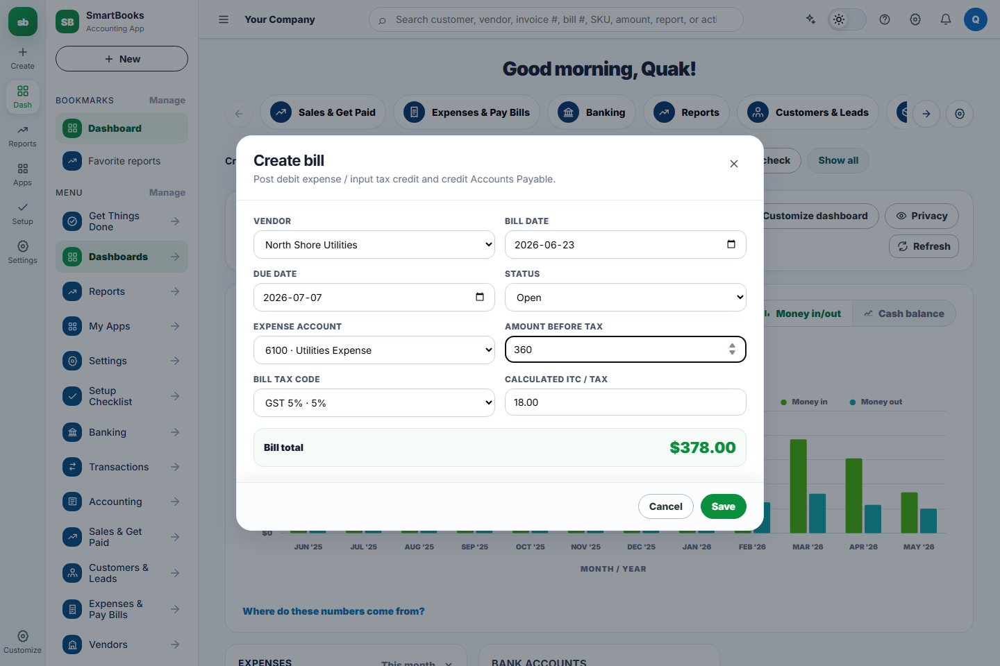

Use these example values:

| Field | Value |
| --- | --- |
| Vendor | North Shore Utilities |
| Bill date | 2026-06-23 |
| Due date | 2026-07-07 |
| Status | Open |
| Expense account | 6100 - Utilities Expense |
| Amount before tax | 360 |
| Bill tax code | GST 5% |

Click **Save**.

Expected result:

- SmartBooks creates an open vendor bill.
- Calculated ITC / tax is 18.
- Bill total is 378.
- Accounts Payable increases by 378.
- No cash or bank movement occurs yet.

### Step 2: Confirm The Bill Posted To A/P

Open **Expenses & Pay Bills**, then select the **Bills & A/P** tab.

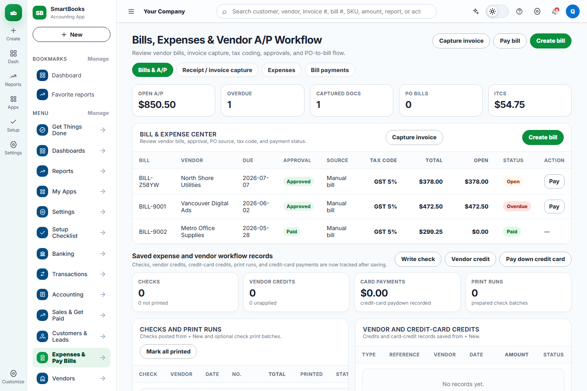

Expected result:

- The new bill appears at the top of the Bill & Expense Center.
- Total shows 378.
- Open shows 378.
- Status is Open.
- Open A/P increases from 472.50 to 850.50 in this example.

### Step 3: Pay The Bill

Open the pay bill workflow, select the bill, choose the bank account, and confirm the payment amount.

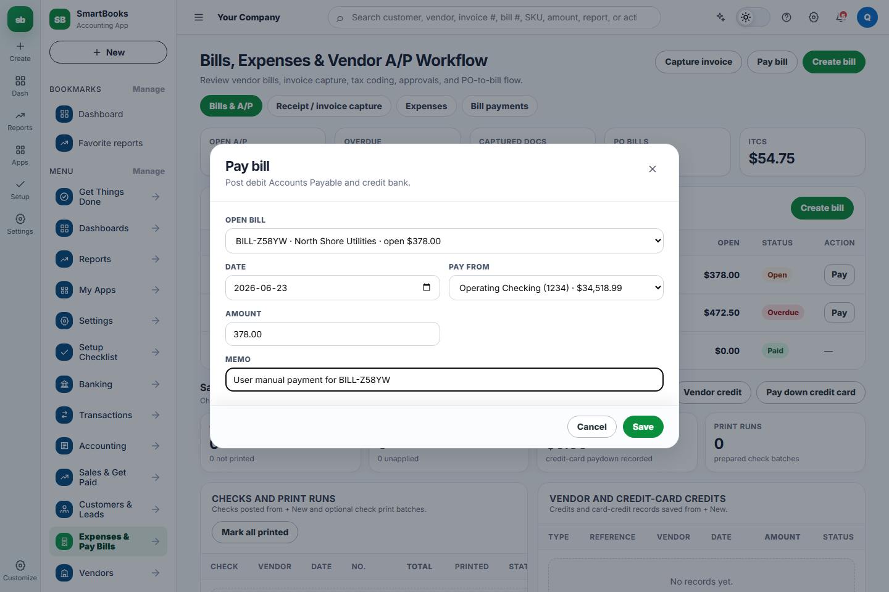

Use these example values:

| Field | Value |
| --- | --- |
| Open bill | The bill created in Step 1 |
| Date | 2026-06-23 |
| Pay from | Operating Checking (1234) |
| Amount | 378 |
| Memo | User manual payment for the selected bill |

Click **Save**.

Expected result:

- SmartBooks creates a bill payment.
- The bill status changes to Paid.
- Accounts Payable decreases by 378.
- Operating Checking decreases by 378.

### Step 4: Confirm The Payment Posted

Open **Expenses & Pay Bills**, then select the **Bill payments** tab.

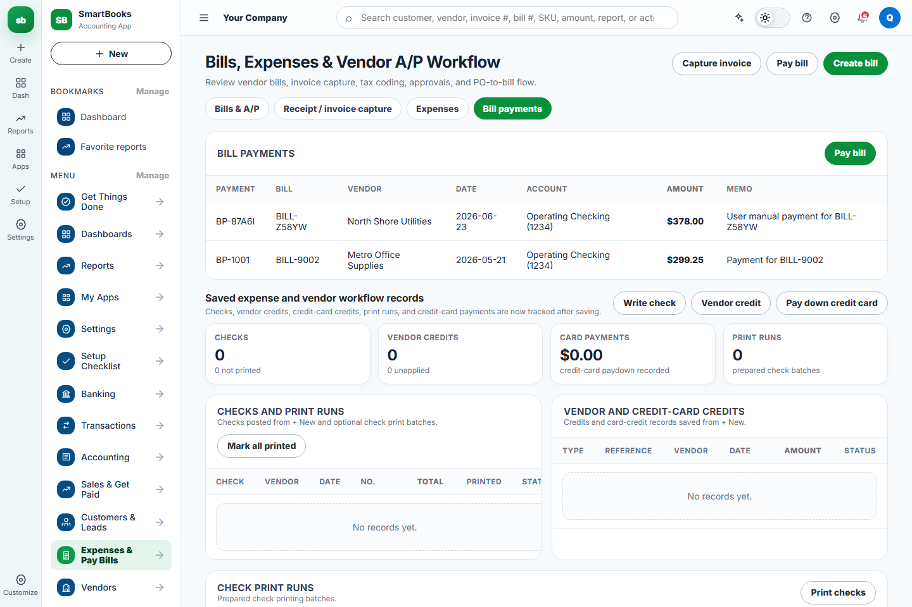

Expected result:

- A bill payment appears for the selected bill.
- Amount shows 378.
- Account shows Operating Checking (1234).
- The paid bill no longer has an open balance.

### Step 5: Verify A/P Aging

Open Reports, then run **Accounts Payable Aging Summary**.

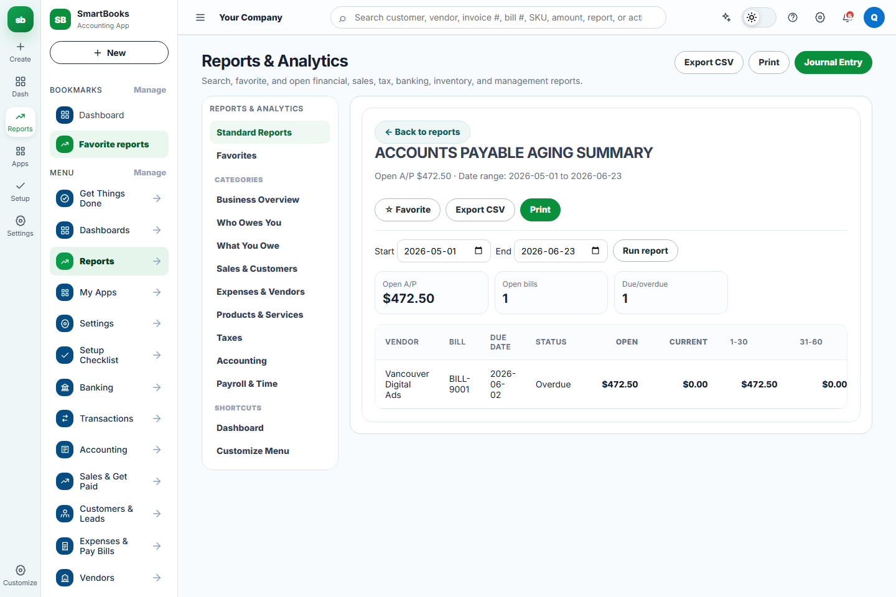

Expected result:

- The report runs without errors.
- Open A/P returns to the previous open payable balance.
- In this example, open A/P returns to 472.50 because the new bill was paid in full.
- The paid bill does not appear as an open payable.

## Troubleshooting

| Symptom | What to check |
| --- | --- |
| Invoice does not appear after save | Confirm the invoice modal was submitted with **Create invoice** and no required fields were blank. |
| Payment does not close the invoice | Confirm the selected customer and selected invoice match, and that the payment amount equals the invoice balance. |
| A/R report still shows the paid invoice | Refresh or rerun the report, confirm the payment was saved, and confirm the report date range includes the invoice date. |
| Expense does not appear after save | Confirm **Save** was clicked, then open **Expenses & Pay Bills** and switch to the **Expenses** tab. |
| Profit and Loss does not increase by the full paid amount | Confirm whether the purchase tax is recoverable. Recoverable GST/HST increases input tax credit instead of P&L expenses. |
| Bank balance does not match the paid amount | Confirm the selected **Paid from** account and remember that bank/cash decreases by amount plus tax. |
| Bill does not appear in A/P | Confirm the bill status is **Open**, then open **Expenses & Pay Bills** and switch to the **Bills & A/P** tab. |
| Paid bill still appears as open | Confirm the payment amount equals the full open bill balance and the bill status changed to **Paid**. |
| Bank balance changes when creating the bill | A bill should not move cash until paid. Check whether an expense was recorded instead of a bill. |
| Values differ from this manual | Demo data may have changed. Reset company data before retesting the exact example values. |

## Next Manual Candidates

Use this same format for the next business flows:

- Review bank transaction -> Categorize -> Verify banking and ledger impact.
- Customize menu -> Add bookmark -> Save -> Confirm sidebar persistence.
